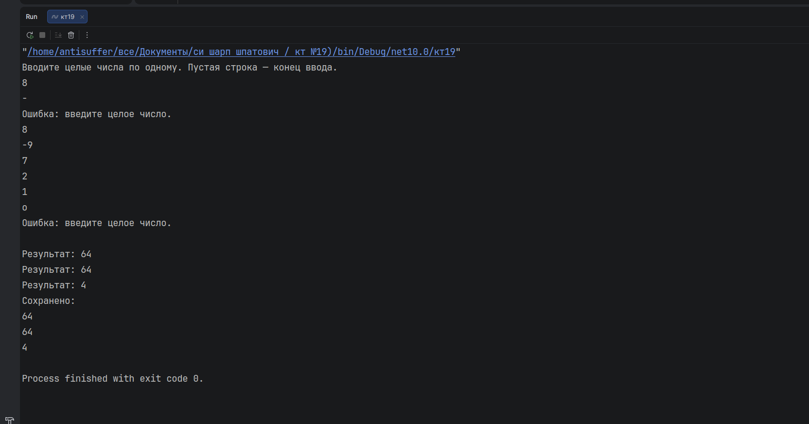

# КТ №19 — Делегаты и лямбда-выражения

**Вариант 1 — Обработка чисел**

- `List<int> numbers` с произвольным набором положительных и отрицательных чисел.
- Лямбда-фильтр `Func<int, bool>`: оставляет только чётные числа.
- Лямбда-преобразование `Func<int, int>`: возводит число в квадрат.
- Два лямбда-действия `Action<int>`, объединённые через `+=` в один многоадресный делегат: одно выводит результат на экран, второе сохраняет его в отдельный список.
- Конвейер: для каждого чётного числа вычислить квадрат и выполнить объединённое действие с результатом.

## Проверочные ключи

| Ввод | Ожидаемый результат |
|---|---|
| `8` | `Результат: 64`, число 64 сохранено в список |
| `2` | `Результат: 4`, число 4 сохранено в список |
| `-9`, `7`, `1` | ничего не выводится: нечётные числа отфильтрованы |
| `-`, `o` | `Ошибка: введите целое число.` |
| пустая строка | конец ввода, вывод списка `Сохранено:` |

## Результат выполнения

